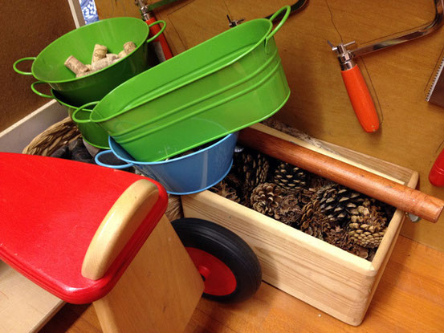

## Hallo Eltern und Kinder!

Wir sind der Elterninitiativ-Kinderladen »Die Kinkies« e.V. Unser Verein ist
beim Amtsgericht Charlottenburg (Berlin) im Vereinsregister unter der Nummer
VR9456B eingetragen.

Unsere Adresse lautet:

> EKT »Die Kinkies« e.V. \
> Weisestr. 4 \
> 12049 Berlin-Neukölln \
> Tel.: 030 89655951 (Bitte keine Platzanfragen) \
> Email: <vorstand.kinkies@gmail.com>

Der Kinderladen hat wochentags geöffnet von 8:00 bis 16:30 Uhr.

Wendet euch bei Platzanfragen bitte an unsere Email Adresse.

Wir suchen immer wieder nach Honorarkräften, die in Krankheitsfällen oder
ähnlichem bei uns aushelfen können. Bei Interesse schickt bitte eine Mail.

## Wir sind die Kinkies

Wir betreuen 21 Kinder zwischen 1 und 6 Jahren und unser Team besteht aktuell aus 4 Erzieherinnen, sowie einer Erzieherin als Quereinsteigerin, einer Erzieherin in Ausbildung und einer Köchin. Außerdem unterstützen uns bei Bedarf unsere tollen Honorarkräfte.

Wir haben ein teiloffenes Konzept mit einer Krippe- und einer Elementargruppe.

Wir arbeiten ohne pädagogische Leitung und setzen im Team auf Eigeninitiative und gemeinsame Entscheidungsprozesse. Wir arbeiten nach dem Berliner Bildungsprogramm und einem situationsorientierten, gendersensiblen und inklusiven Ansatz.

Unsere Köchin verwöhnt uns mit selbst gekochtem, vegetarischem Bio-Essen.

Unser Kinderladen liegt im Schillerpromenadenkiez. Sowohl die Hasenheide als
auch das Flughafengelände sind gut zu erreichen. Er ist in einer großen, hellen
Ladenwohnung untergebracht. Zur Verfügung stehen den Kindern ein Spielzimmer, ein Bastel- und Essensraum sowie ein Schlaf- und Bewegungsraum.

## Was wir unternehmen

In unserem Alltag gehen wir regelmäßig und gerne raus und machen längere Ausflüge z.B. in die Hasenheide oder auf das Tempelhofer Feld. Einmal in der Woche kommt ein Musiker zum gemeinsamen Musizieren. Ansonsten lassen wir den Kindern gerne viel Raum für selbst bestimmtes Spielen und Lernen.

Neben dem täglichen Angebot aus den unterschiedlichen Spielmöglichkeiten, die
der Laden bietet, gibt es eine Reihe von Aktivitäten, die den Kindern von den
Erzieherinnen als Angebot gemacht werden:

* Kochen und Backen: Jeden zweiten Freitag kochen die Kinder im Kinderladen.

* Bibliothek: Die Kinder gehen regelmäßig in die Stadtbibliothek Neukölln.

* Theater: Wir nutzen gern die unterschiedlichen Möglichkeiten unseres Kiezes,
  ins Theater zu gehen.
  
* Kinderladenübernachtung: Einmal im Jahr findet eine Kinderladenübernachtung
  statt.

* Feste und Feiern: Feste im Jahreskalender werden gemeinsam gefeiert
  (Geburtstage, Weihnachten und Ostern, Sommerfest, Sankt Martin, Karneval).

  
